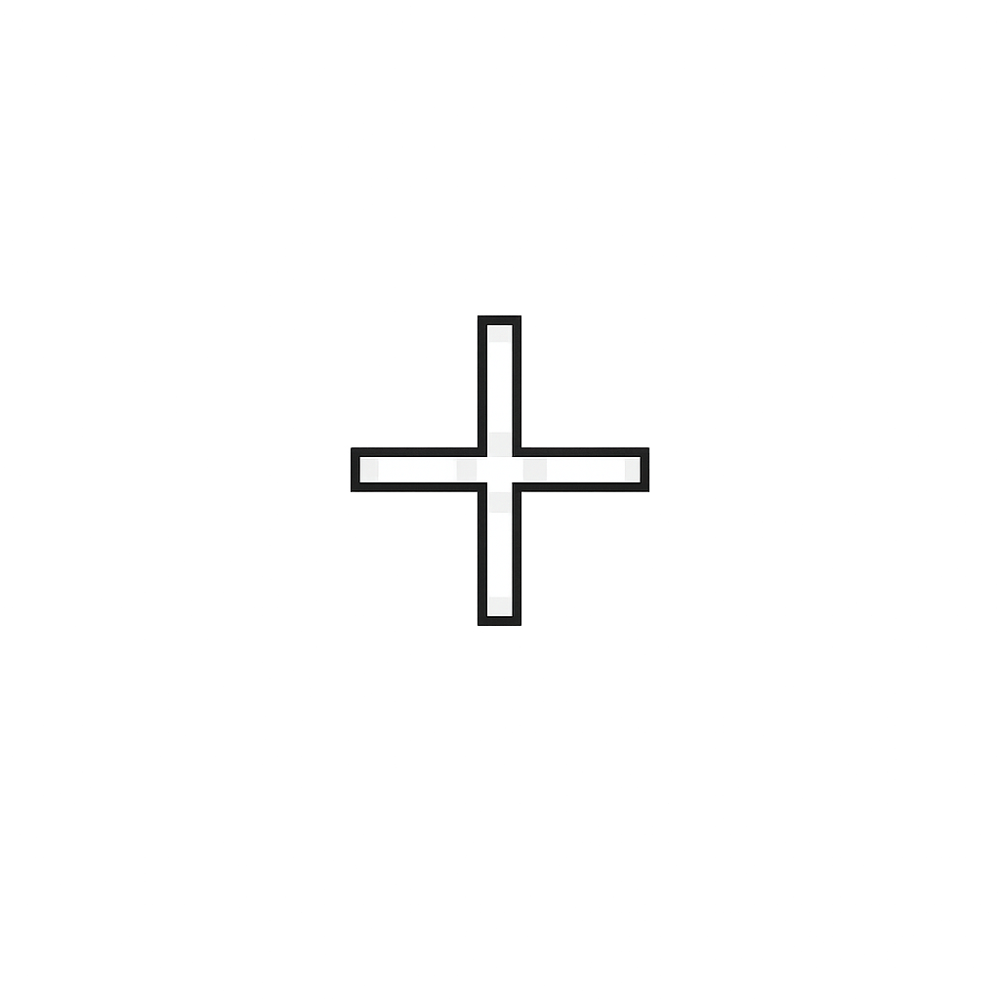

# 游戏构思
这款游戏参考如下两个游戏：
- 我的世界：第一人称
- 我的世界地下城：第三人称【上帝视角】
- 泰拉瑞亚：事件，Boss机制

游戏最终效果如下：
- 开放式的，无限地形，所有地形都是方块【像我的世界】
- 对于树木，怪物，主角并不是方块的
- 游戏有两个视角：两种视角可以自由自由切换
  1. 我的世界那种，方便玩家建造，探索
  2. 我的世界地下城那种，方便玩家探索，杀怪
- 游戏有各种怪，各种地形，各种方块，各种装备：就像我的世界地下城
- 对于建造，要能像我的世界那样，建起复杂建筑。未来要实现蓝图功能，只要建好一次，就可以用蓝图一键建造
- 游戏是给中国人玩的，要考虑中国人的审美
- 方块要和我的世界的区分开来，防止版权纠纷

这个宏大的游戏效果是未来的最终效果


# 游戏剧情

故事不再是西方的克苏鲁，背景故事要考虑中国人

游戏是个中国版的 Minecraft + Terraria【甚至后期还会有类似帝国时代的玩法】：

出生地：树林

夜间会生成大量僵尸，让玩家在第三人称视角下打得爽


# 开发环境

https://unity.com/download，使用google账号登录。下载安装UnityHub，然后安装：Unity 6.3 LTS (6000.3.19f1)，勾选：

- Microsoft Visual Studio Community
- Windows Build Support (IL2CPP)
- Android Build Support
  - Android SDK & NDK Tools
  - OpenJDK

新建项目：Universal 3D (URP)

Assets/Scenes/SampleScene重命名为Main。Assets下新建目录：Scripts、Materials、Prefabs

设置输入系统

```
Edit > Project Settings > Player > Other Settings > Active Input Handling
```

改成：

```
Both
```

重启 Unity  


# 开发路线

第一阶段（地基）：

- 简单地形：已实现
- 人物移动：已实现
- 视角切换：已实现
- 背包/装备栏/物品掉落：已实现
- 方块坚硬度：已实现
- 人物血条：已实现
- 第三人称视角：方案设计更改，新方案实现中
- 确定画风
- 简单美术
- 功能完善

第二阶段（MC）：

- chunk
- 天气
- 日夜交替
- 各种方块
- 树/草
- 简单生物
- 僵尸
- 无限地图
- 模型设计
- 美术
- 存档

第三阶段（地下城）：

- 各种地对生物
- 各种地形
- 各种事件如鬼市【类似于血月】
- 少量剧情
- npc

第四阶段（大型）：

- 蓝图系统
-  地牢
- Boss
- 联机
- 手机适配

# 已实现功能

角色在一片方块地形，wsad上下左右移动，空格跳跃，按v切换视角，放置破坏方块

按数字键或点击物品栏切换物品，按B或点击...打开背包

## 方块

Assets/Materials 创建 3 个材质：右键 -> Create > Material

```
Grass.mat   绿色
Dirt.mat   棕色
Stone.mat   灰色
```


在 `Assets/Scripts` 创建 `BlockDefinition.cs`：

```c#
using UnityEngine;

// CreateAssetMenu：可以在 Project 面板右键创建不同种类的方块资源
[CreateAssetMenu(fileName = "New Block", menuName = "EverVoxel/Block Definition")]
public class BlockDefinition : ScriptableObject
{
    [Header("Basic Info")]
    public string displayName = "新方块";

    [Header("Appearance")]
    // 材质
    public Material material;
    // 图标
    public Sprite itemIcon;

    [Header("Gameplay")]
    // 是否有实体碰撞
    public bool isSolid = true;

    // 是否允许被破坏
    public bool isBreakable = true;

    // 硬度
    public float hardness = 1f;
}
```


在 `Assets` 下新建一个目录`Blocks`

然后在 `Blocks` 目录空白处右键：Create -> EverVoxel -> Block Definition

创建三个资源并命名：GrassBlock、DirtBlock、StoneBlock。依次选中它们，在 Inspector 设置：

| 方块资源   | Display Name | Material  | Hardness |
| ---------- | ------------ | --------- | -------- |
| GrassBlock | 草方块       | Grass.mat | 1        |
| DirtBlock  | 泥土         | Dirt.mat  | 0.8      |
| StoneBlock | 石头         | Stone.mat | 3        |

`Is Solid` 与 `Is Breakable` 都保持勾选


 `Assets/Scripts` 新建`Block.cs`：

```c#
using UnityEngine;

public class Block : MonoBehaviour
{
    [Header("Block Data")]
    [SerializeField] private BlockDefinition definition;
    public BlockDefinition Definition => definition;

    // 初始化方块
    public void Initialize(BlockDefinition blockDefinition)
    {
        definition = blockDefinition;
        ApplyDefinition();
    }

    private void ApplyDefinition()
    {
        if (definition == null)
        {
            return;
        }

        // 设置方块材质
        Renderer blockRenderer = GetComponent<Renderer>();

        if (blockRenderer != null && definition.material != null)
        {
            blockRenderer.material = definition.material;
        }

        // 是否启用碰撞体
        Collider blockCollider = GetComponent<Collider>();

        if (blockCollider != null)
        {
            blockCollider.enabled = definition.isSolid;
        }

        // 场景中显示的物体名称更清楚【例如：GrassBlock (草方块)】
        gameObject.name = $"{definition.name} ({definition.displayName})";
    }
}
```


## 地形

Assets/Scripts 创建 VoxelWorld.cs

```c#
using UnityEngine;

public class VoxelWorld : MonoBehaviour
{
    [Header("World Size")]
    public int width = 32;
    public int depth = 32;
    public int maxHeight = 6;

    [Header("Noise")]
    public float noiseScale = 12f;

    [Header("Block Types")]
    public BlockDefinition grassBlock;
    public BlockDefinition dirtBlock;
    public BlockDefinition stoneBlock;

    private void Start()
    {
        GenerateWorld();
    }

    private void GenerateWorld()
    {
        for (int x = 0; x < width; x++)
        {
            for (int z = 0; z < depth; z++)
            {
                float noise = Mathf.PerlinNoise(x / noiseScale, z / noiseScale);
                int height = Mathf.FloorToInt(noise * maxHeight) + 1;

                for (int y = 0; y < height; y++)
                {
                    CreateTerrainBlock(x, y, z, height);
                }
            }
        }
    }

    // 根据方块所在高度，决定它应该是什么种类
    private void CreateTerrainBlock(int x, int y, int z, int columnHeight)
    {
        BlockDefinition blockToCreate;

        // 最顶部生成草方块
        if (y == columnHeight - 1)
        {
            blockToCreate = grassBlock;
        }
        // 草方块下方两层生成泥土
        else if (y >= columnHeight - 3)
        {
            blockToCreate = dirtBlock;
        }
        // 更深处生成石头
        else
        {
            blockToCreate = stoneBlock;
        }

        CreateBlock(new Vector3Int(x, y, z), blockToCreate);
    }

    // 创建方块
    public GameObject CreateBlock(Vector3Int blockPosition, BlockDefinition blockDefinition)
    {
        if (blockDefinition == null)
        {
            return null;
        }

        // 创建 Unity Cube【Cube 自带 Mesh Renderer 和 Box Collider】
        GameObject blockObject = GameObject.CreatePrimitive(PrimitiveType.Cube);
        blockObject.transform.position = blockPosition;

        // 所有方块都放到 World 下
        blockObject.transform.parent = transform;

        // 为该 Cube 添加 Block 组件，保存它的真实类型
        Block block = blockObject.AddComponent<Block>();

        // 把草、泥土、石头等定义写入这个方块
        block.Initialize(blockDefinition);

        return blockObject;
    }

    // 创建方块掉落物
    public GameObject SpawnBlockDrop(Vector3 worldPosition, BlockDefinition blockDefinition)
    {
        if (blockDefinition == null)
        {
            return null;
        }

        GameObject dropObject = GameObject.CreatePrimitive(PrimitiveType.Cube);

        // 让掉落物从被破坏方块稍微上方出现。
        // X/Z 有轻微随机偏移，多个方块掉落时不会完全重叠。
        Vector3 randomOffset = new Vector3(
            Random.Range(-0.18f, 0.18f),
            0.65f,
            Random.Range(-0.18f, 0.18f)
        );

        dropObject.transform.position = worldPosition + randomOffset;
        dropObject.transform.parent = transform;

        // 掉落物不添加 Block 组件。因此玩家不能把掉落物再次当成世界方块挖掉。
        BlockDrop blockDrop = dropObject.AddComponent<BlockDrop>();
        blockDrop.Initialize(blockDefinition);

        return dropObject;
    }
}
```

在 Hierarchy 里右键 -> Create Empty 命名为 World

把 `VoxelWorld.cs` 拖到 `World` 上

把 3 种方块拖到`VoxelWorld`组件对应位置

```
GrassBlock  -> Grass Block
DirtBlock   -> Dirt Block
StoneBlock  -> Stone Block
```


## 方块掉落

在 `Assets/Scripts` 新建 `BlockDrop.cs`

```c#
using UnityEngine;

// 方块掉落物挂载的脚本
public class BlockDrop : MonoBehaviour
{
    [Header("Drop Data")]
    // 掉落物对应的方块
    [SerializeField] private BlockDefinition definition;

    [Header("Visual")]
    // 掉落物大小
    public float dropScale = 0.35f;
    // 漂浮高度
    public float floatingHeight = 0.08f;
    // 漂浮速度
    public float floatingSpeed = 2.5f;
    // 旋转速度
    public float rotationSpeed = 70f;

    [Header("Fall")]
    // 下落速度
    public float fallSpeed = 5f;
    // 地面检测误差
    public float groundCheckPadding = 0.03f;

    [Header("Pickup")]
    // 自动拾取范围
    public float pickupRange = 1.5f;
    // 生成后多久可以拾取
    public float pickupDelay = 0.35f;
    // 是否已经落地
    private bool hasLanded;
    // 落地位置
    private Vector3 restingPosition;
    // 漂浮随机偏移
    private float floatingOffset;
    // 存活时间
    private float aliveTime;
    // 玩家背包
    private PlayerInventory playerInventory;

    public BlockDefinition Definition => definition;

    // 初始化掉落物
    public void Initialize(BlockDefinition blockDefinition)
    {
        definition = blockDefinition;

        // 缩小显示
        transform.localScale = Vector3.one * dropScale;

        // 随机旋转
        transform.rotation = Random.rotation;

        // 随机漂浮相位
        floatingOffset = Random.Range(0f, Mathf.PI * 2f);

        // 设置材质
        Renderer dropRenderer = GetComponent<Renderer>();

        if (dropRenderer != null &&
            definition != null &&
            definition.material != null)
        {
            dropRenderer.sharedMaterial = definition.material;
        }

        // 掉落物关闭碰撞
        Collider dropCollider = GetComponent<Collider>();

        if (dropCollider != null)
        {
            dropCollider.enabled = false;
        }

        string blockName = definition != null
            ? definition.displayName
            : "未知方块";

        gameObject.name = $"掉落物 - {blockName}";
    }

    private void Start()
    {
        // 玩家背包
        playerInventory = FindFirstObjectByType<PlayerInventory>();
    }

    private void Update()
    {
        aliveTime += Time.deltaTime;

        // 未落地：下落
        if (!hasLanded)
        {
            FallToGround();
            return;
        }

        // 落地后漂浮旋转
        FloatAndRotate();

        // 检测拾取
        TryPickup();
    }

    // 掉落物下落
    private void FallToGround()
    {
        float halfDropHeight = transform.localScale.y * 0.5f;
        float fallDistance =
            fallSpeed * Time.deltaTime +
            halfDropHeight +
            groundCheckPadding;

        if (TryGetGroundBelow(fallDistance, out RaycastHit groundHit))
        {
            restingPosition = new Vector3(
                transform.position.x,
                groundHit.point.y + halfDropHeight,
                transform.position.z
            );

            transform.position = restingPosition;
            hasLanded = true;
            return;
        }

        transform.position += Vector3.down * fallSpeed * Time.deltaTime;
    }

    // 检测下面的方块
    private bool TryGetGroundBelow(
        float checkDistance,
        out RaycastHit closestGround)
    {
        closestGround = default;
        float closestDistance = float.MaxValue;

        RaycastHit[] hits = Physics.RaycastAll(
            transform.position,
            Vector3.down,
            checkDistance
        );

        foreach (RaycastHit hit in hits)
        {
            Block block = hit.collider.GetComponent<Block>();

            if (block == null)
            {
                continue;
            }

            if (hit.distance < closestDistance)
            {
                closestDistance = hit.distance;
                closestGround = hit;
            }
        }

        return closestDistance != float.MaxValue;
    }

    // 漂浮旋转
    private void FloatAndRotate()
    {
        float floatingY = Mathf.Sin(
            Time.time * floatingSpeed + floatingOffset
        ) * floatingHeight;

        transform.position = restingPosition + Vector3.up * floatingY;

        transform.Rotate(
            Vector3.up,
            rotationSpeed * Time.deltaTime,
            Space.World
        );
    }

    // 自动拾取
    private void TryPickup()
    {
        if (aliveTime < pickupDelay || definition == null)
        {
            return;
        }

        if (playerInventory == null)
        {
            playerInventory = FindFirstObjectByType<PlayerInventory>();

            if (playerInventory == null)
            {
                return;
            }
        }

        float distance = Vector3.Distance(
            transform.position,
            playerInventory.transform.position
        );

        if (distance > pickupRange)
        {
            return;
        }

        // 加入背包成功后删除掉落物
        if (playerInventory.TryAddItem(definition, 1))
        {
            Destroy(gameObject);
        }
    }
}
```


## 角色

在 Hierarchy 里：右键 > 3D Object > Capsule 命名 Player

设置位置：

```
Position X: 16
Position Y: 12
Position Z: 16
```

给 Player 添加组件：

```
Add Component > Character Controller
```

设置 Character Controller：

```
Center X: 0
Center Y: 0
Center Z: 0

Height: 2
Radius: 0.5
```

Capsule 自带的 Capsule Collider 可以删掉，因为我们用 `Character Controller`

在Assets/Scripts 创建 `PlayerController.cs`

```c#
using UnityEngine;

[RequireComponent(typeof(CharacterController))]
public class PlayerController : MonoBehaviour
{
    public float moveSpeed = 4f;
    public float jumpHeight = 2f;
    public float gravity = -9.8f;   // 重力加速度，负数表示向下

    [Header("View")]
    public CameraModeController cameraModeController;

    private CharacterController controller;
    private Vector3 velocity;
    private bool canJump;

    private void Awake()
    {
        // 获取CharacterController
        controller = GetComponent<CharacterController>();

        if (cameraModeController == null)
        {
            cameraModeController = Camera.main.GetComponent<CameraModeController>();
        }
    }

    private void Update()
    {
        // 在地面允许跳跃
        if (controller.isGrounded)
        {
            canJump = true;
            velocity.y = -2f;
        }

        // 获取输入按键ADWS
        float horizontal = Input.GetAxis("Horizontal");
        float vertical = Input.GetAxis("Vertical");

        Vector3 move;

        // 第一人称运动逻辑
        if (cameraModeController != null && cameraModeController.IsFirstPerson)
        {
            Vector3 forward = transform.forward;
            Vector3 right = transform.right;

            forward.y = 0f;
            right.y = 0f;

            forward.Normalize();
            right.Normalize();

            move = forward * vertical + right * horizontal;
        }
        else   // 第三人称运动逻辑
        {
            move = new Vector3(horizontal, 0f, vertical);
        }

        move = Vector3.ClampMagnitude(move, 1f);

        // 跳跃逻辑
        if (canJump && Input.GetKeyDown(KeyCode.Space))
        {
            // v2=v02​+2as
            velocity.y = Mathf.Sqrt(jumpHeight * -2f * gravity);
            canJump = false;
        }

        velocity.y += gravity * Time.deltaTime;

        // 把水平移动和竖直移动合并成一个向量
        Vector3 finalMove = move * moveSpeed;
        finalMove.y = velocity.y;

        controller.Move(finalMove * Time.deltaTime);
    }
}
```

选中 `Player`

1. 把 `PlayerController.cs` 拖到 `Player` 上
2. 把 `Main Camera` 拖到 `PlayerController` 的 `Camera Mode Controller` 字段


## 第一人称的准星

在Hierarchy空白处右键 -> 选择UI(Canvas) -> 选择Canvas

Hierarchy中会变成：

- Canvas
- EventSystem（自动生成的，不能删）


选中Hierarchy中创建的Canvas，Inspector里面找到Canvas组件。检查如下选项，保证为：

- Render Mode选项：选择Screen Space - Overlay【含义：UI画在整个游戏画面的最上层】

Inspector里面找到Canvas Scaler组件。检查如下选项，保证为：

- UI Scale Mode选项：选择Scale With Screen Size【含义：自动按屏幕大小缩放UI】
- Reference Resolution选项：x 1920   y 1080
- Screen Match Mode选项：选择Match Width Or Height
- Match选项：选择0.5


右键Hierarchy中创建的Canvas -> 选择UI(Canvas) -> 选择Image，重命名为Crosshair

最终Hierarchy应该变成：

- Canvas
  - Crosshair
- EventSystem

选中Hierarchy中Canvas下的Crosshair，Inspector里面找到Rect Transform组件：

- Anchor Presets选项【位于左上方的方块】：选择Middle Center
- width、height：100 100


Assets目录下新建Sprites目录，Sprites目录导进去Crosshair.png



选中Crosshair.png，Inspector里面，找到Texture Type选项，选择Sprite (2D and UI)

找到Sprite Mode选项，选择Single，然后点击Apply。


然后引用图片：点击Hierarchy中Canvas下的Crosshair，Inspector里面找到Image组件：

Source Image选项：把Crosshair.png拖进去

Image Type选项：Simple

Image Type选项下的Preserve Aspect：勾选


## 视角

按v切换第三人称【上帝视角】视角、第一人称


选中场景里的 `Main Camera`。设置初始位置：

```
Position X: 16
Position Y: 18
Position Z: 6

Rotation X: 60
Rotation Y: 0
Rotation Z: 0
```


在 `Assets/Scripts` 创建 `CameraModeController.cs`

```c#
using UnityEngine;

public class CameraModeController : MonoBehaviour
{
    public enum ViewMode
    {
        TopDown,   // 第三人称【俯视角】
        FirstPerson   // 第一人称
    }

    [Header("References")]
    public Transform target;   // 角色

    [Header("Switch")]
    public KeyCode switchKey = KeyCode.V;   // 切换视角的按键为v
    public ViewMode currentMode = ViewMode.TopDown;   // 默认第三人称视角

    [Header("Top Down")]
    public Vector3 topDownOffset = new Vector3(0f, 10f, -10f);
    public float topDownSmoothSpeed = 8f;

    [Header("First Person")]
    public Vector3 firstPersonOffset = new Vector3(0f, 0.75f, 0f);

    [Header("UI")]
    public GameObject crosshair;
    public float mouseSensitivity = 2.5f;   // 鼠标灵敏度
    public float minPitch = -80f;   // 第一人称允许向上下看的最大角度
    public float maxPitch = 80f;

    // 人物负责左右旋转（yaw），相机继承人物的左右旋转，再额外负责上下旋转
    private float yaw;   // 角色左右旋转角度
    private float pitch;   // 相机上下俯仰角

    public bool IsFirstPerson => currentMode == ViewMode.FirstPerson;

    private void Start()
    {
        if (target != null)
        {
            // 初始化yaw，使相机朝向与角色初始朝向一致
            yaw = target.eulerAngles.y;
        }
        // 根据当前模式设置鼠标状态
        ApplyCursorState();
    }

    private void Update()
    {
        // v键切换视角
        if (Input.GetKeyDown(switchKey))
        {
            ToggleMode();
        }

        // 第一人称下，根据鼠标移动更新角色朝向和相机俯仰角
        if (IsFirstPerson)
        {
            UpdateFirstPersonLook();
        }
    }

    private void LateUpdate()
    {
        if (target == null)
        {
            return;
        }

        if (IsFirstPerson)
        {
            UpdateFirstPersonCamera();
        }
        else
        {
            UpdateTopDownCamera();
        }
    }

    // 切换视角
    private void ToggleMode()
    {
        currentMode = IsFirstPerson ? ViewMode.TopDown : ViewMode.FirstPerson;

        if (target != null)
        {
            yaw = target.eulerAngles.y;
        }

        // 重置上下视角，避免切换回第一人称时仍保持之前的俯仰角
        pitch = 0f;
        ApplyCursorState();
    }

    // 根据当前模式设置鼠标状态
    private void ApplyCursorState()
    {
        if (IsFirstPerson)
        {
            // 锁定鼠标到屏幕中央
            Cursor.lockState = CursorLockMode.Locked;
            // 第一人称隐藏鼠标
            Cursor.visible = false;

            if (crosshair != null)
            {
                crosshair.SetActive(true);
            }
        }
        else
        {
            Cursor.lockState = CursorLockMode.None;
            Cursor.visible = true;

            if (crosshair != null)
            {
                crosshair.SetActive(false);
            }
        }
    }

    private void UpdateFirstPersonLook()
    {
        float mouseX = Input.GetAxis("Mouse X") * mouseSensitivity;
        float mouseY = Input.GetAxis("Mouse Y") * mouseSensitivity;

        yaw += mouseX;
        pitch -= mouseY;
        pitch = Mathf.Clamp(pitch, minPitch, maxPitch);

        target.rotation = Quaternion.Euler(0f, yaw, 0f);
    }

    private void UpdateFirstPersonCamera()
    {
        // 将相机放到角色头部位置
        transform.position = target.position + target.TransformDirection(firstPersonOffset);
        // 应用pitch和yaw，实现第一人称视角
        transform.rotation = Quaternion.Euler(pitch, yaw, 0f);
    }

    private void UpdateTopDownCamera()
    {
        Vector3 desiredPosition = target.position + topDownOffset;

        transform.position = Vector3.Lerp(
            transform.position,
            desiredPosition,
            topDownSmoothSpeed * Time.deltaTime
        );

        transform.LookAt(target.position + Vector3.up);
    }
}
```

选中 `Main Camera`

1. 把 `CameraModeController.cs` 拖到 `Main Camera` 上
2. 把 Hierarchy 里的 `Player` 拖到 `Target`字段
3. 把 Hierarchy 里`Canvas`下的`Crosshair`拖到`Crosshair`字段


## 放置/摧毁方块

鼠标左键摧毁，鼠标右键放置：

- 第三人称：范围是以角色为球心2个单元格半径
- 第一人称：同MC


在 `Assets/Scripts` 创建 `BlockInteraction.cs`

```c#
using UnityEngine;
using UnityEngine.EventSystems;

// 玩家与方块交互系统
// 1. 挖掘方块
// 2. 放置方块
// 3. 根据方块硬度计算挖掘时间
// 4. 与背包系统同步物品数量
public class BlockInteraction : MonoBehaviour
{
    [Header("References")]
    public Camera playerCamera;
    public Transform worldRoot;
    // 用于判断当前是第一人称还是第三人称
    public CameraModeController cameraModeController;

    [Header("Placement")]
    // 放置的方块
    public BlockDefinition placeBlock;
    // 放置的范围
    public float interactRange = 5f;

    [Header("Breaking")]
    // 最终挖掘时间 = baseBreakTime * hardness
    public float baseBreakTime = 0.75f;

    private VoxelWorld voxelWorld;
    private PlayerInventory inventory;
    // 当前正在被玩家按住左键挖掘的方块
    private Block breakingBlock;
    // 当前已经挖掘的时间
    private float currentBreakTime;

    private void Awake()
    {
        if (playerCamera == null)
        {
            playerCamera = Camera.main;
        }

        if (cameraModeController == null && playerCamera != null)
        {
            cameraModeController =
                playerCamera.GetComponent<CameraModeController>();
        }

        if (worldRoot != null)
        {
            voxelWorld = worldRoot.GetComponent<VoxelWorld>();
        }

        inventory = GetComponent<PlayerInventory>();
    }

    private void Update()
    {
        // 打开背包时禁止操作世界
        if (InventoryUI.IsAnyInventoryOpen)
        {
            CancelBreakingBlock();
            return;
        }

        // 鼠标位于UI上时，不响应方块操作
        if (EventSystem.current != null &&
            EventSystem.current.IsPointerOverGameObject())
        {
            CancelBreakingBlock();
            return;
        }

        // 左键挖掘方块
        if (Input.GetMouseButtonDown(0))
        {
            BeginBreakingBlock();
        }

        // 持续挖掘
        if (Input.GetMouseButton(0))
        {
            ContinueBreakingBlock();
        }

        // 松开左键取消挖掘
        if (Input.GetMouseButtonUp(0))
        {
            CancelBreakingBlock();
        }

        // 右键放置方块
        if (Input.GetMouseButtonDown(1))
        {
            TryPlaceBlock();
        }
    }

    // 获取玩家当前瞄准的方块
    // 第一人称：从屏幕中心发射射线
    // 第三人称：从鼠标位置发射射线
    private bool TryGetTargetBlock(out RaycastHit hit)
    {
        hit = default;

        Ray ray;

        if (cameraModeController != null &&
            cameraModeController.IsFirstPerson)
        {
            ray = playerCamera.ScreenPointToRay(
                new Vector3(
                    Screen.width * 0.5f,
                    Screen.height * 0.5f,
                    0f
                )
            );
        }
        else
        {
            ray = playerCamera.ScreenPointToRay(Input.mousePosition);
        }

        if (!Physics.Raycast(ray, out hit, 100f))
        {
            return false;
        }

        // 只有带Block组件的对象才是真正方块
        Block targetBlock = hit.collider.GetComponent<Block>();

        if (targetBlock == null)
        {
            return false;
        }

        // 只允许操作World下的方块
        if (worldRoot != null &&
            hit.collider.transform.parent != worldRoot)
        {
            return false;
        }

        // 检查玩家距离
        return Vector3.Distance(
            transform.position,
            hit.collider.transform.position
        ) <= interactRange;
    }

    // 开始挖掘方块
    // 左键第一次按下时调用
    // 保存当前目标方块
    private void BeginBreakingBlock()
    {
        CancelBreakingBlock();

        if (!TryGetTargetBlock(out RaycastHit hit))
        {
            return;
        }

        Block targetBlock = hit.collider.GetComponent<Block>();

        if (targetBlock == null ||
            targetBlock.Definition == null ||
            !targetBlock.Definition.isBreakable)
        {
            return;
        }

        breakingBlock = targetBlock;
    }
    // 持续挖掘方块
    // 玩家需要持续看向同一个方块
    // 根据hardness判断是否达到破坏时间
    private void ContinueBreakingBlock()
    {
        if (breakingBlock == null)
        {
            return;
        }

        if (!TryGetTargetBlock(out RaycastHit hit) ||
            hit.collider.GetComponent<Block>() != breakingBlock)
        {
            CancelBreakingBlock();
            return;
        }

        BlockDefinition definition = breakingBlock.Definition;

        if (definition == null || !definition.isBreakable)
        {
            CancelBreakingBlock();
            return;
        }

        // hardness越高，需要挖掘时间越长
        float breakTime =
            baseBreakTime * Mathf.Max(0.05f, definition.hardness);

        currentBreakTime += Time.deltaTime;

        if (currentBreakTime >= breakTime)
        {
            Vector3 position = breakingBlock.transform.position;
            // 生成掉落物
            if (voxelWorld != null)
            {
                voxelWorld.SpawnBlockDrop(position, definition);
            }
            // 删除原方块
            Destroy(breakingBlock.gameObject);
            CancelBreakingBlock();
        }
    }

    // 取消当前挖掘状态
    // 用于：
    // 1. 松开鼠标
    // 2. 改变目标方块
    // 3. 打开背包
    private void CancelBreakingBlock()
    {
        breakingBlock = null;
        currentBreakTime = 0f;
    }

    // 放置当前选择的方块
    // 创建成功后：
    // 消耗背包中的一个物品
    private void TryPlaceBlock()
    {
        if (inventory != null && !inventory.HasSelectedItem())
        {
            return;
        }

        if (placeBlock == null || !TryGetTargetBlock(out RaycastHit hit))
        {
            return;
        }

        // 根据点击面的方向计算放置位置
        Vector3 placePosition = hit.collider.transform.position + hit.normal;

        // 转换为整数坐标
        Vector3Int gridPosition = new Vector3Int(
            Mathf.RoundToInt(placePosition.x),
            Mathf.RoundToInt(placePosition.y),
            Mathf.RoundToInt(placePosition.z)
        );

        // 防止方块重叠
        if (Physics.CheckBox(gridPosition, Vector3.one * 0.45f))
        {
            return;
        }

        if (voxelWorld == null)
        {
            return;
        }

        // 创建方块
        GameObject createdBlock =
            voxelWorld.CreateBlock(gridPosition, placeBlock);

        // 放置成功后消耗物品
        if (createdBlock != null && inventory != null)
        {
            inventory.ConsumeSelectedItem();
        }
    }
}
```

把它挂到 `Player`

1. 把 `Main Camera` 拖到 `Player Camera`字段
2. 把 `World` 拖到 `World Root`字段
4. 把 `Main Camera` 拖到  `Camera Mode Controller `字段
4. 把 `Assets/Blocks/GrassBlock`拖到 `Place Block`字段


## 物品栏/背包

在 `Assets/Scripts` 新建 `PlayerInventory.cs`

```c#
using System;
using UnityEngine;

// 背包单个格子的数据类
[Serializable]
public class InventorySlotData
{
    // 当前格子的方块类型
    public BlockDefinition block;

    // 当前数量
    [Min(0)]
    public int amount;

    // 是否为空
    // 没有物品或者数量为0，都认为空
    public bool IsEmpty => block == null || amount <= 0;

    // 清空格子
    public void Clear()
    {
        block = null;
        amount = 0;
    }
}

// 背包数据
[RequireComponent(typeof(BlockInteraction))]
public class PlayerInventory : MonoBehaviour
{
    // 快捷栏数量
    public const int HotbarSlotCount = 9;
    // 普通背包物品栏数量
    public const int BackpackSlotCount = 27;
    // 每个物品栏最大数量
    public const int MaxStackSize = 999;

    [Header("References")]
    public BlockInteraction blockInteraction;

    [Header("快捷栏：屏幕下方前 9 格")]
    // 快捷栏
    // 玩家数字键1-9选择这里的物品
    public InventorySlotData[] hotbar = new InventorySlotData[HotbarSlotCount];

    [Header("背包：27 格")]
    // 背包区域
    public InventorySlotData[] backpack = new InventorySlotData[BackpackSlotCount];

    [Range(0, HotbarSlotCount - 1)]
    // 当前选中的快捷栏索引
    public int selectedHotbarIndex;

    // 外部读取当前选择位置
    public int SelectedHotbarIndex => selectedHotbarIndex;

    // 背包变化事件
    // UI监听这个事件刷新显示
    public event Action InventoryChanged;

    private void Awake()
    {
        if (blockInteraction == null)
        {
            blockInteraction = GetComponent<BlockInteraction>();
        }

        EnsureSlots();
    }

    private void Start()
    {
        // 初始化当前选择物品
        SelectHotbarSlot(selectedHotbarIndex);
        NotifyChanged();
    }

    private void Update()
    {
        // 打开背包时禁止快捷键切换
        if (InventoryUI.IsAnyInventoryOpen)
        {
            return;
        }

        // 数字键1-9切换快捷栏
        for (int i = 0; i < HotbarSlotCount; i++)
        {
            if (Input.GetKeyDown(KeyCode.Alpha1 + i))
            {
                SelectHotbarSlot(i);
            }
        }
    }

    // 初始化背包格子
    private void EnsureSlots()
    {
        if (hotbar == null || hotbar.Length != HotbarSlotCount)
        {
            hotbar = new InventorySlotData[HotbarSlotCount];
        }

        if (backpack == null || backpack.Length != BackpackSlotCount)
        {
            backpack = new InventorySlotData[BackpackSlotCount];
        }

        // 创建快捷栏格子
        for (int i = 0; i < hotbar.Length; i++)
        {
            if (hotbar[i] == null)
            {
                hotbar[i] = new InventorySlotData();
            }
        }

        // 创建背包格子
        for (int i = 0; i < backpack.Length; i++)
        {
            if (backpack[i] == null)
            {
                backpack[i] = new InventorySlotData();
            }
        }
    }

    // 获取快捷栏指定格子
    public InventorySlotData GetHotbarSlot(int index)
    {
        return index >= 0 && index < hotbar.Length ? hotbar[index] : null;
    }

    // 获取背包指定格子
    public InventorySlotData GetBackpackSlot(int index)
    {
        return index >= 0 && index < backpack.Length ? backpack[index] : null;
    }

    // 当前快捷栏是否有物品
    public bool HasSelectedItem()
    {
        InventorySlotData slot = GetHotbarSlot(selectedHotbarIndex);
        return slot != null && !slot.IsEmpty;
    }

    // 选择快捷栏
    public void SelectHotbarSlot(int index)
    {
        if (index < 0 || index >= HotbarSlotCount)
        {
            return;
        }

        selectedHotbarIndex = index;
        ApplySelectedItemToPlacement();
        NotifyChanged();
    }

    // 消耗当前选择物品
    // 放置方块时调用
    public bool ConsumeSelectedItem()
    {
        InventorySlotData slot = GetHotbarSlot(selectedHotbarIndex);

        if (slot == null || slot.IsEmpty)
        {
            return false;
        }

        slot.amount--;

        if (slot.amount <= 0)
        {
            slot.Clear();
        }

        ApplySelectedItemToPlacement();
        NotifyChanged();
        return true;
    }

    // 添加物品
    // 掉落物拾取时调用
    public bool TryAddItem(BlockDefinition blockDefinition, int amount)
    {
        if (blockDefinition == null || amount <= 0)
        {
            return false;
        }

        int remaining = amount;

        // 优先填充已有同类物品
        remaining = AddToExistingSlots(hotbar, blockDefinition, remaining);
        remaining = AddToExistingSlots(backpack, blockDefinition, remaining);

        // 没有空余堆叠后，再找空格子
        remaining = AddToEmptySlots(hotbar, blockDefinition, remaining);
        remaining = AddToEmptySlots(backpack, blockDefinition, remaining);

        if (remaining != amount)
        {
            ApplySelectedItemToPlacement();
            NotifyChanged();
        }

        // true 代表全部加入背包；false 代表背包已经完全满了
        return remaining == 0;
    }

    // 添加到已有物品格
    private int AddToExistingSlots(
        InventorySlotData[] slots,
        BlockDefinition blockDefinition,
        int remaining)
    {
        foreach (InventorySlotData slot in slots)
        {
            if (remaining <= 0)
            {
                break;
            }

            // 不是同一种物品
            if (slot.IsEmpty || slot.block != blockDefinition)
            {
                continue;
            }

            // 当前格还能放多少
            int canAdd = MaxStackSize - slot.amount;

            if (canAdd <= 0)
            {
                continue;
            }

            int addAmount = Mathf.Min(canAdd, remaining);
            slot.amount += addAmount;
            remaining -= addAmount;
        }

        return remaining;
    }

    // 添加到空格子
    private int AddToEmptySlots(
        InventorySlotData[] slots,
        BlockDefinition blockDefinition,
        int remaining)
    {
        foreach (InventorySlotData slot in slots)
        {
            if (remaining <= 0)
            {
                break;
            }

            if (!slot.IsEmpty)
            {
                continue;
            }

            int addAmount = Mathf.Min(MaxStackSize, remaining);
            slot.block = blockDefinition;
            slot.amount = addAmount;
            remaining -= addAmount;
        }

        return remaining;
    }

    // 交换快捷栏和背包物品
    // 点击背包格子时调用
    public void SwapSelectedHotbarWithBackpack(int backpackIndex)
    {
        InventorySlotData hotbarSlot = GetHotbarSlot(selectedHotbarIndex);
        InventorySlotData backpackSlot = GetBackpackSlot(backpackIndex);

        if (hotbarSlot == null || backpackSlot == null)
        {
            return;
        }

        BlockDefinition temporaryBlock = hotbarSlot.block;
        int temporaryAmount = hotbarSlot.amount;

        hotbarSlot.block = backpackSlot.block;
        hotbarSlot.amount = backpackSlot.amount;

        backpackSlot.block = temporaryBlock;
        backpackSlot.amount = temporaryAmount;

        ApplySelectedItemToPlacement();
        NotifyChanged();
    }

    // 把当前快捷栏物品同步给放置系统
    private void ApplySelectedItemToPlacement()
    {
        if (blockInteraction == null)
        {
            return;
        }

        InventorySlotData slot = GetHotbarSlot(selectedHotbarIndex);

        blockInteraction.placeBlock =
            slot != null && !slot.IsEmpty
            ? slot.block
            : null;
    }

    // 通知UI刷新
    private void NotifyChanged()
    {
        InventoryChanged?.Invoke();
    }
}
```

在 `Assets/Scripts` 新建 `InventoryUI.cs`

```c#
using System.Collections.Generic;
using UnityEngine;
using UnityEngine.UI;

// 背包UI系统
public class InventoryUI : MonoBehaviour
{
    // UI中的一个物品格
    private class SlotView
    {
        // 物品图片
        public Image icon;
        // 数量文字
        public Text amount;
        // 选中效果
        public GameObject selected;
        // 是否属于快捷栏
        public bool isHotbar;
        // 对应背包索引
        public int index;
    }

    public static bool IsAnyInventoryOpen { get; private set; }

    [Header("References")]
    // 玩家背包数据
    public PlayerInventory playerInventory;
    // 用于判断第一人称/第三人称状态
    public CameraModeController cameraModeController;

    [Header("Keys")]
    // 打开背包按键
    public KeyCode toggleKey = KeyCode.B;

    // 快捷栏UI列表
    private readonly List<SlotView> hotbarSlots = new();
    // 背包UI列表
    private readonly List<SlotView> backpackSlots = new();

    // 背包窗口
    private GameObject inventoryPanel;
    // 默认字体
    private Font defaultFont;

    private void Start()
    {
        if (playerInventory == null)
        {
            playerInventory = FindFirstObjectByType<PlayerInventory>();
        }

        if (cameraModeController == null && Camera.main != null)
        {
            cameraModeController =
                Camera.main.GetComponent<CameraModeController>();
        }

        // 获取Unity默认字体
        defaultFont = Resources.GetBuiltinResource<Font>(
            "LegacyRuntime.ttf"
        );
        // 创建快捷栏
        CreateHotbar();
        // 创建背包窗口
        CreateBackpack();

        // 监听背包变化
        // 物品变化时自动刷新UI
        if (playerInventory != null)
        {
            playerInventory.InventoryChanged += RefreshAll;
        }

        // 默认关闭背包
        SetInventoryOpen(false);

        // 初始刷新
        RefreshAll();
    }

    private void Update()
    {
        // B键打开/关闭背包
        if (Input.GetKeyDown(toggleKey))
        {
            SetInventoryOpen(!IsAnyInventoryOpen);
        }
        // ESC关闭背包
        if (IsAnyInventoryOpen && Input.GetKeyDown(KeyCode.Escape))
        {
            SetInventoryOpen(false);
        }
    }

    private void OnDestroy()
    {
        if (playerInventory != null)
        {
            playerInventory.InventoryChanged -= RefreshAll;
        }

        // 恢复游戏时间
        Time.timeScale = 1f;
        IsAnyInventoryOpen = false;
    }

    // 创建底部快捷栏
    // 显示玩家当前可以快速使用的9个物品
    private void CreateHotbar()
    {
        // 创建快捷栏根节点
        GameObject root = CreateUIObject("Hotbar", transform);
        RectTransform rect = root.GetComponent<RectTransform>();

        // 设置快捷栏位置：屏幕底部居中
        rect.anchorMin = new Vector2(0.5f, 0f);
        rect.anchorMax = new Vector2(0.5f, 0f);
        rect.pivot = new Vector2(0.5f, 0f);
        rect.anchoredPosition = new Vector2(0f, 45f);

        // 快捷栏大小
        rect.sizeDelta = new Vector2(860f, 88f);

        // 背景
        Image background = root.AddComponent<Image>();
        background.color = new Color(0f, 0f, 0f, 0.65f);

        // 水平排列格子
        HorizontalLayoutGroup layout =
            root.AddComponent<HorizontalLayoutGroup>();

        layout.padding = new RectOffset(6, 6, 6, 6);
        layout.spacing = 5f;
        layout.childAlignment = TextAnchor.MiddleCenter;
        layout.childForceExpandWidth = false;
        layout.childForceExpandHeight = false;

        // 创建9个快捷栏格子
        for (int i = 0; i < PlayerInventory.HotbarSlotCount; i++)
        {
            int slotIndex = i;
            // 创建格子UI
            SlotView view = CreateSlot(root.transform, true, slotIndex);

            // 设置选中颜色
            view.selected.GetComponent<Image>().color =
                new Color(1f, 0.8f, 0f, 0.35f);

            // 点击快捷栏切换物品
            root.transform.GetChild(i).GetComponent<Button>().onClick
                .AddListener(() => playerInventory.SelectHotbarSlot(slotIndex));

            hotbarSlots.Add(view);
        }

        // 创建打开背包按钮
        GameObject moreButton = CreateButton(root.transform, "…");
        moreButton.GetComponent<Button>().onClick.AddListener(
            () => SetInventoryOpen(true)
        );
    }

    // 创建背包窗口
    private void CreateBackpack()
    {
        // 创建背包面板
        inventoryPanel = CreateUIObject("InventoryPanel", transform);

        RectTransform panelRect =
            inventoryPanel.GetComponent<RectTransform>();

        // 设置窗口居中
        panelRect.anchorMin = new Vector2(0.5f, 0.5f);
        panelRect.anchorMax = new Vector2(0.5f, 0.5f);
        panelRect.pivot = new Vector2(0.5f, 0.5f);

        // 背包窗口大小
        panelRect.sizeDelta = new Vector2(820f, 470f);

        // 背景
        Image panelImage = inventoryPanel.AddComponent<Image>();
        panelImage.color = new Color(0.08f, 0.08f, 0.08f, 0.95f);

        // 创建标题
        GameObject title = CreateTextObject(
            "Title",
            inventoryPanel.transform,
            "背包"
        );

        RectTransform titleRect = title.GetComponent<RectTransform>();
        // 标题位置
        titleRect.anchorMin = new Vector2(0f, 1f);
        titleRect.anchorMax = new Vector2(1f, 1f);
        titleRect.pivot = new Vector2(0.5f, 1f);
        titleRect.anchoredPosition = new Vector2(0f, -18f);
        titleRect.sizeDelta = new Vector2(0f, 40f);

        title.GetComponent<Text>().alignment = TextAnchor.MiddleCenter;
        title.GetComponent<Text>().fontSize = 28;

        // 创建关闭按钮
        GameObject closeButton = CreateButton(
            inventoryPanel.transform,
            "X"
        );

        RectTransform closeRect =
            closeButton.GetComponent<RectTransform>();

        // 放在右上角
        closeRect.anchorMin = new Vector2(1f, 1f);
        closeRect.anchorMax = new Vector2(1f, 1f);
        closeRect.pivot = new Vector2(1f, 1f);
        closeRect.anchoredPosition = new Vector2(-15f, -15f);

        // 点击关闭
        closeButton.GetComponent<Button>().onClick.AddListener(
            () => SetInventoryOpen(false)
        );

        // 创建背包格子区域
        GameObject grid = CreateUIObject(
            "BackpackSlots",
            inventoryPanel.transform
        );

        RectTransform gridRect = grid.GetComponent<RectTransform>();
        // 格子区域居中
        gridRect.anchorMin = new Vector2(0.5f, 0.5f);
        gridRect.anchorMax = new Vector2(0.5f, 0.5f);
        gridRect.pivot = new Vector2(0.5f, 0.5f);
        gridRect.sizeDelta = new Vector2(744f, 300f);
        gridRect.anchoredPosition = new Vector2(0f, -25f);

        // 网格布局
        GridLayoutGroup gridLayout = grid.AddComponent<GridLayoutGroup>();
        // 每个格子大小
        gridLayout.cellSize = new Vector2(76f, 76f);
        // 格子间距
        gridLayout.spacing = new Vector2(6f, 6f);
        // 固定9列
        gridLayout.constraint =
            GridLayoutGroup.Constraint.FixedColumnCount;
        gridLayout.constraintCount = 9;
        gridLayout.childAlignment = TextAnchor.MiddleCenter;

        // 创建27个背包格子
        for (int i = 0; i < PlayerInventory.BackpackSlotCount; i++)
        {
            int slotIndex = i;
            SlotView view = CreateSlot(grid.transform, false, slotIndex);

            // 点击背包格子交换物品
            grid.transform.GetChild(i).GetComponent<Button>().onClick
                .AddListener(() =>
                    playerInventory.SwapSelectedHotbarWithBackpack(slotIndex)
                );

            backpackSlots.Add(view);
        }
    }

    // 创建一个物品格
    private SlotView CreateSlot(
        Transform parent,
        bool isHotbar,
        int index)
    {
        // 创建按钮作为格子
        // 点击格子需要响应操作
        GameObject slot = CreateButton(parent, "");

        // 设置格子背景颜色
        Image background = slot.GetComponent<Image>();
        background.color = new Color(0.25f, 0.25f, 0.25f, 1f);

        // 创建物品图标
        GameObject iconObject = CreateUIObject("Icon", slot.transform);
        Image icon = iconObject.AddComponent<Image>();

        // 图标不接收点击
        icon.raycastTarget = false;

        // 图标铺满格子
        Stretch(iconObject.GetComponent<RectTransform>(), 8f);

        // 创建数量文字
        GameObject amountObject = CreateTextObject(
            "Amount",
            slot.transform,
            ""
        );

        RectTransform amountRect =
            amountObject.GetComponent<RectTransform>();

        // 数量显示在右下角
        amountRect.anchorMin = Vector2.zero;
        amountRect.anchorMax = new Vector2(1f, 0f);
        amountRect.pivot = new Vector2(1f, 0f);
        amountRect.anchoredPosition = new Vector2(-5f, 4f);
        amountRect.sizeDelta = new Vector2(-10f, 28f);

        Text amountText = amountObject.GetComponent<Text>();
        amountText.alignment = TextAnchor.LowerRight;
        amountText.fontSize = 20;
        amountText.color = Color.white;

        // 数量文字不阻挡点击
        amountText.raycastTarget = false;

        // 创建选中框
        // 快捷栏当前选择物品时显示
        GameObject selected = CreateUIObject("Selected", slot.transform);
        Image selectedImage = selected.AddComponent<Image>();
        // 不影响按钮点击
        selectedImage.raycastTarget = false;
        // 铺满整个格子
        Stretch(selected.GetComponent<RectTransform>(), 0f);

        return new SlotView
        {
            icon = icon,
            amount = amountText,
            selected = selected,
            isHotbar = isHotbar,
            index = index
        };
    }

    // 创建按钮
    private GameObject CreateButton(Transform parent, string text)
    {
        // 创建按钮对象
        GameObject buttonObject = CreateUIObject("Button", parent);

        // 设置按钮默认大小
        LayoutElement layout = buttonObject.AddComponent<LayoutElement>();
        layout.preferredWidth = 76f;
        layout.preferredHeight = 76f;

        // 添加背景
        Image image = buttonObject.AddComponent<Image>();
        image.color = new Color(0.25f, 0.25f, 0.25f, 1f);

        // 添加点击组件
        Button button = buttonObject.AddComponent<Button>();

        // 有文字时创建文字显示
        if (!string.IsNullOrEmpty(text))
        {
            GameObject textObject = CreateTextObject(
                "Text",
                buttonObject.transform,
                text
            );
            // 文字铺满按钮
            Stretch(textObject.GetComponent<RectTransform>(), 0f);

            Text uiText = textObject.GetComponent<Text>();
            uiText.alignment = TextAnchor.MiddleCenter;
            uiText.fontSize = 36;
            // 文字不阻挡按钮点击
            uiText.raycastTarget = false;
        }

        return buttonObject;
    }

    // 创建文字对象
    private GameObject CreateTextObject(
        string name,
        Transform parent,
        string content)
    {
        GameObject textObject = CreateUIObject(name, parent);
        Text text = textObject.AddComponent<Text>();

        // 使用默认字体
        text.font = defaultFont;
        text.text = content;
        text.color = Color.white;

        return textObject;
    }

    // 创建UI空对象
    // 所有UI元素最终都会通过它创建
    private GameObject CreateUIObject(string name, Transform parent)
    {
        GameObject uiObject = new GameObject(
            name,
            typeof(RectTransform)
        );

        uiObject.transform.SetParent(parent, false);
        return uiObject;
    }

    // 设置UI拉伸范围
    // padding控制四周边距
    private void Stretch(RectTransform rect, float padding)
    {
        // 从左下角到右上角铺满
        rect.anchorMin = Vector2.zero;
        rect.anchorMax = Vector2.one;
        rect.offsetMin = new Vector2(padding, padding);
        rect.offsetMax = new Vector2(-padding, -padding);
    }

    // 刷新全部背包UI
    // 当背包数据变化时调用
    private void RefreshAll()
    {
        RefreshList(hotbarSlots);
        RefreshList(backpackSlots);
    }

    // 刷新一组格子
    // 将背包数据同步到UI显示
    private void RefreshList(List<SlotView> slots)
    {
        // 没有背包数据，不刷新
        if (playerInventory == null)
        {
            return;
        }

        foreach (SlotView view in slots)
        {
            // 根据类型获取对应数据
            InventorySlotData data = view.isHotbar
                ? playerInventory.GetHotbarSlot(view.index)
                : playerInventory.GetBackpackSlot(view.index);

            // 判断当前格子是否有物品
            bool hasItem = data != null && !data.IsEmpty;

            // 正式代码
            //view.icon.enabled =
            //    hasItem &&
            //    data.block != null &&
            //    data.block.itemIcon != null;

            //if (view.icon.enabled)
            //{
            //    view.icon.sprite = data.block.itemIcon;
            //}

            //view.amount.text = hasItem && data.amount > 1
            //    ? data.amount.ToString()
            //    : "";

            // 测试用，物品栏显示文字
            // ===================
            bool hasIcon = hasItem && data.block != null && data.block.itemIcon != null;

            view.icon.enabled = hasIcon;

            if (hasIcon)
            {
                view.icon.sprite = data.block.itemIcon;
                view.amount.text = data.amount > 1
                    ? data.amount.ToString()
                    : "";
            }
            else if (hasItem)
            {
                // 暂时没有图标时，直接显示方块名称和数量。
                view.amount.text = $"{data.amount}-{data.block.displayName}";
            }
            else
            {
                view.amount.text = "";
            }

            // ===================

            view.selected.SetActive(
                view.isHotbar &&
                playerInventory.SelectedHotbarIndex == view.index
            );
        }
    }

    // 打开/关闭背包
    private void SetInventoryOpen(bool isOpen)
    {
        // 保存当前背包状态
        IsAnyInventoryOpen = isOpen;

        // 显示或隐藏背包窗口
        if (inventoryPanel != null)
        {
            inventoryPanel.SetActive(isOpen);
        }

        // 打开背包暂停游戏
        // 防止玩家移动和操作
        Time.timeScale = isOpen ? 0f : 1f;

        if (isOpen)
        {
            // 打开背包释放鼠标
            Cursor.lockState = CursorLockMode.None;
            Cursor.visible = true;
            return;
        }

        // 关闭背包后恢复鼠标状态
        bool firstPerson =
            cameraModeController != null &&
            cameraModeController.IsFirstPerson;

        // 第一人称重新锁定鼠标
        Cursor.lockState = firstPerson
            ? CursorLockMode.Locked
            : CursorLockMode.None;

        // 第一人称隐藏鼠标
        Cursor.visible = !firstPerson;
    }
}
```

给 Hierarchy 中的 Player 添加组件：

```
Add Component > PlayerInventory
```

在`Player Inventory`组件中：把 Hierarchy 里的 `Player` 拖入 `Block Interaction`字段 


给 Hierarchy 中的 Canvas 添加组件：

```
Add Component > InventoryUI
```

在`Inventory UI`组件中，把 Hierarchy 中的 `Player`拖入`Player Inventory`字段

在`Inventory UI`组件中，把 Hierarchy 中的 `Main Camera`拖入`Camera Mode Controller` 字段


## 生命值

在 `Assets/Scripts` 下新建 `PlayerStats.cs`

```c#
using System;
using UnityEngine;

// 人物基础属性系统
// 1. 保存当前生命值和生命上限
// 2. 保存护甲值和魔抗值
// 3. 提供受到伤害、恢复生命、提升生命上限的方法
// 4. 通知UI刷新生命显示
public class PlayerStats : MonoBehaviour
{
    [Header("生命值")]
    // 人物初始生命上限
    [Min(1f)]
    [SerializeField] private float maxHealth = 100f;

    // 人物当前生命值
    // 初始值为100，代表满血
    [Min(0f)]
    [SerializeField] private float currentHealth = 100f;

    [Header("防御属性")]
    // 当前护甲值
    // 没有装备时为0
    [Min(0f)]
    [SerializeField] private float armor = 0f;

    // 当前魔抗值
    // 没有装备时为0
    [Min(0f)]
    [SerializeField] private float magicResistance = 0f;

    [Header("测试")]
    // 勾选后可以在运行时测试生命值变化
    // 减号键：受到10点物理伤害
    // 等号键：恢复10点生命
    public bool enableDebugKeys;

    // 外部只读当前生命上限
    public float MaxHealth => maxHealth;

    // 外部只读当前生命值
    public float CurrentHealth => currentHealth;

    // 外部只读当前护甲值
    public float Armor => armor;

    // 外部只读当前魔抗值
    public float MagicResistance => magicResistance;

    // 生命值改变事件
    // 参数依次为：当前生命值、生命上限
    // UI会监听这个事件，生命变化时自动刷新
    public event Action<float, float> HealthChanged;

    private void Awake()
    {
        // 防止Inspector里填写的当前生命超过生命上限
        currentHealth = Mathf.Clamp(currentHealth, 0f, maxHealth);
    }

    private void Start()
    {
        // 游戏开始时通知UI显示初始生命
        NotifyHealthChanged();
    }

    private void Update()
    {
        test();
    }

    // 仅用于开发测试
    // 正式游戏时不勾选 enableDebugKeys 即可
    private void test() {
        if (!enableDebugKeys)
        {
            return;
        }

        // 减号键：受到10点物理伤害
        if (Input.GetKeyDown(KeyCode.Minus))
        {
            TakePhysicalDamage(10f);
        }

        // 等号键：恢复10点生命
        if (Input.GetKeyDown(KeyCode.Equals))
        {
            RestoreHealth(10f);
        }
    }

    // 受到物理伤害
    public void TakePhysicalDamage(float rawDamage)
    {
        // 伤害不能小于0
        if (rawDamage <= 0f)
        {
            return;
        }

        // 护甲减伤公式：
        // 护甲为0时，受到100%伤害
        // 护甲越高，伤害越低，但不会直接变成无敌
        float finalDamage = CalculateReducedDamage(rawDamage, armor);

        ChangeHealth(-finalDamage);
    }

    // 受到魔法伤害
    public void TakeMagicDamage(float rawDamage)
    {
        // 伤害不能小于0
        if (rawDamage <= 0f)
        {
            return;
        }

        // 魔抗减伤公式与护甲相同
        float finalDamage = CalculateReducedDamage(
            rawDamage,
            magicResistance
        );

        ChangeHealth(-finalDamage);
    }

    // 恢复生命
    public void RestoreHealth(float amount)
    {
        if (amount <= 0f)
        {
            return;
        }

        ChangeHealth(amount);
    }

    // 提升生命上限
    public void IncreaseMaxHealth(
        float amount,
        bool increaseCurrentHealthToo = true)
    {
        if (amount <= 0f)
        {
            return;
        }

        maxHealth += amount;

        if (increaseCurrentHealthToo)
        {
            currentHealth += amount;
        }

        // 防止当前生命超过新的上限
        currentHealth = Mathf.Clamp(currentHealth, 0f, maxHealth);

        NotifyHealthChanged();
    }

    // 设置护甲值
    // 装备系统计算完总护甲后调用
    public void SetArmor(float newArmor)
    {
        armor = Mathf.Max(0f, newArmor);
    }

    // 设置魔抗值
    // 装备系统计算完总魔抗后调用
    public void SetMagicResistance(float newMagicResistance)
    {
        magicResistance = Mathf.Max(0f, newMagicResistance);
    }

    // 改变生命值
    // amount为正数时回血，为负数时扣血
    private void ChangeHealth(float amount)
    {
        currentHealth = Mathf.Clamp(
            currentHealth + amount,
            0f,
            maxHealth
        );

        NotifyHealthChanged();

        // 当前生命值归零时触发死亡逻辑
        if (currentHealth <= 0f)
        {
            Die();
        }
    }

    // 根据防御值计算减伤后的伤害
    private float CalculateReducedDamage(
        float rawDamage,
        float defense)
    {
        // 防御值为0时：
        // finalDamage = rawDamage
        //
        // 防御值越高，伤害越低
        // 例如100点防御时，伤害约减少50%
        return rawDamage * 100f / (100f + defense);
    }

    // 通知所有监听生命值的系统刷新
    private void NotifyHealthChanged()
    {
        HealthChanged?.Invoke(currentHealth, maxHealth);
    }

    // 人物死亡
    private void Die()
    {
        Debug.Log("人物生命值归零，人物死亡。");
    }
}
```

在 `Assets/Scripts` 下新建 `PlayerHealthUI.cs`

```c#
using UnityEngine;
using UnityEngine.UI;

// 人物心形生命UI
public class PlayerHealthUI : MonoBehaviour
{
    [Header("References")]
    // 玩家的人物属性脚本
    public PlayerStats playerStats;

    [Header("UI设置")]
    // 心形容器在屏幕上的大小
    public float heartSize = 118f;

    // 心形UI距离屏幕左上角的距离
    public Vector2 screenOffset = new Vector2(34f, -34f);

    // 未填满生命值时显示的暗红色
    // 它不是边框，只用于表示生命上限容器
    public Color emptyHealthColor = new Color(
        0.22f,
        0.035f,
        0.045f,
        0.8f
    );

    // 当前生命值显示的红色
    public Color healthColor = new Color(
        0.95f,
        0.05f,
        0.08f,
        1f
    );

    // 红色生命填充图片
    private Image healthFillImage;

    // 自动生成的完整心形精灵
    private Sprite heartSprite;

    private void Start()
    {
        if (playerStats == null)
        {
            playerStats = FindFirstObjectByType<PlayerStats>();
        }

        heartSprite = CreateHeartSprite();

        // 创建生命UI
        CreateHealthUI();

        // 监听生命值变化
        if (playerStats != null)
        {
            playerStats.HealthChanged += RefreshHealthUI;

            // 初始刷新
            RefreshHealthUI(
                playerStats.CurrentHealth,
                playerStats.MaxHealth
            );
        }
    }

    private void OnDestroy()
    {
        // 移除事件监听，避免对象销毁后仍然收到通知
        if (playerStats != null)
        {
            playerStats.HealthChanged -= RefreshHealthUI;
        }
    }

    // 创建完整的生命UI
    private void CreateHealthUI()
    {
        // 创建根节点
        GameObject root = CreateUIObject("HeartHealthUI", transform);

        RectTransform rootRect = root.GetComponent<RectTransform>();

        // 固定在屏幕左上角
        rootRect.anchorMin = new Vector2(0f, 1f);
        rootRect.anchorMax = new Vector2(0f, 1f);
        rootRect.pivot = new Vector2(0f, 1f);
        rootRect.anchoredPosition = screenOffset;
        rootRect.sizeDelta = new Vector2(heartSize, heartSize);

        // 创建完整的暗红色心形
        // 用来表示人物的生命上限
        Image emptyHeartImage = CreateHeartImage(
            "EmptyHeart",
            root.transform,
            emptyHealthColor
        );

        Stretch(emptyHeartImage.rectTransform);

        // 创建红色生命填充
        // 红色会从下往上填充，不再有任何边框
        healthFillImage = CreateHeartImage(
            "HealthFill",
            root.transform,
            healthColor
        );

        Stretch(healthFillImage.rectTransform);

        // 设置为从下往上填充
        healthFillImage.type = Image.Type.Filled;
        healthFillImage.fillMethod = Image.FillMethod.Vertical;
        healthFillImage.fillOrigin = 0;
        healthFillImage.fillAmount = 1f;
    }

    // 刷新生命显示
    private void RefreshHealthUI(
        float currentHealth,
        float maxHealth)
    {
        if (healthFillImage == null)
        {
            return;
        }

        // 计算生命百分比
        float healthPercent = maxHealth > 0f
            ? currentHealth / maxHealth
            : 0f;

        // 设置红色填充比例
        healthFillImage.fillAmount = Mathf.Clamp01(healthPercent);
    }

    // 创建一个心形Image
    private Image CreateHeartImage(
        string objectName,
        Transform parent,
        Color color)
    {
        GameObject imageObject = CreateUIObject(objectName, parent);

        Image image = imageObject.AddComponent<Image>();
        image.sprite = heartSprite;
        image.color = color;
        image.preserveAspect = true;
        image.raycastTarget = false;

        return image;
    }

    // 创建UI对象
    private GameObject CreateUIObject(string objectName, Transform parent)
    {
        GameObject uiObject = new GameObject(
            objectName,
            typeof(RectTransform)
        );

        uiObject.transform.SetParent(parent, false);

        return uiObject;
    }

    // 让UI填满父物体
    private void Stretch(RectTransform rectTransform)
    {
        rectTransform.anchorMin = Vector2.zero;
        rectTransform.anchorMax = Vector2.one;
        rectTransform.offsetMin = Vector2.zero;
        rectTransform.offsetMax = Vector2.zero;
    }

    private Sprite CreateHeartSprite()
    {
        const int textureSize = 128;

        Texture2D texture = new Texture2D(
            textureSize,
            textureSize,
            TextureFormat.RGBA32,
            false
        );

        // 使用双线性过滤，让心形边缘更平滑
        texture.filterMode = FilterMode.Bilinear;
        texture.wrapMode = TextureWrapMode.Clamp;

        Color32[] pixels = new Color32[textureSize * textureSize];

        for (int y = 0; y < textureSize; y++)
        {
            for (int x = 0; x < textureSize; x++)
            {
                // 将像素坐标转换为心形数学公式使用的坐标
                float normalizedX =
                    x / (float)(textureSize - 1) * 2.4f - 1.2f;

                float normalizedY =
                    y / (float)(textureSize - 1) * 2.5f - 1.25f;

                // 判断像素是否在完整心形内
                bool isInsideHeart = IsInsideHeart(
                    normalizedX,
                    normalizedY
                );

                int index = y * textureSize + x;

                // 白色区域会被Image组件的颜色染色
                // 透明区域不会显示
                pixels[index] = isInsideHeart
                    ? new Color32(255, 255, 255, 255)
                    : new Color32(255, 255, 255, 0);
            }
        }

        texture.SetPixels32(pixels);
        texture.Apply();

        return Sprite.Create(
            texture,
            new Rect(0f, 0f, textureSize, textureSize),
            new Vector2(0.5f, 0.5f),
            textureSize
        );
    }

    // 心形数学公式
    // 返回true代表指定坐标位于心形区域内
    private bool IsInsideHeart(float x, float y)
    {
        float value =
            Mathf.Pow(x * x + y * y - 1f, 3f) -
            x * x * y * y * y;

        return value <= 0f;
    }
}
```

在 `Hierarchy` 选中 `Player`，点击 `Add Component`。搜索并添加 `Player Stats`


在 `Hierarchy` 中选中现有的 `Canvas`，点击 `Add Component`。搜索并添加 `Player Health UI`

将 `Hierarchy > Player` 拖入 `Player Health UI` 的 `Player Stats` 字段


为了测试红色生命填充是否会变化：

1. 选中 `Player`
2. 勾选 `Player Stats > Enable Debug Keys`
3. 运行游戏
4. 按 `-`：受到 10 点物理伤害
5. 按 `=`：恢复 10 点生命

测试完后取消勾选 `Enable Debug Keys`


